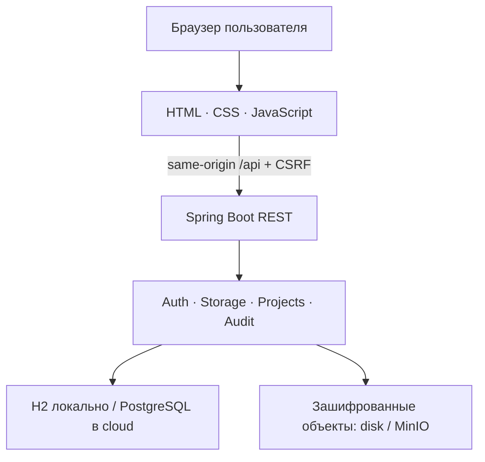
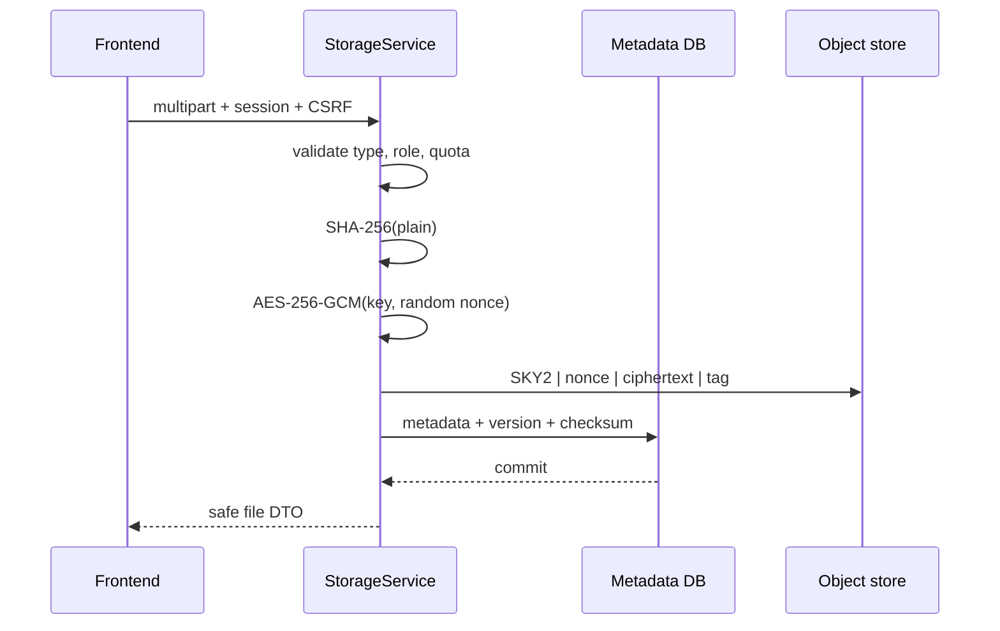
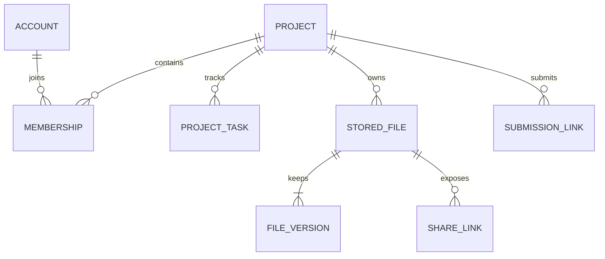

# Архитектура SkyShelf Final 1.0

## Подход

SkyShelf построен как **модульный монолит** с отдельным frontend. Для учебного проекта это даёт простой запуск и понятную отладку, но сохраняет границы предметных модулей:

- Authentication — регистрация, сессии, профиль и лимит входов;
- Storage — файлы, папки, версии, квоты, корзина и ссылки;
- Projects — роли, кастомизация, чек‑лист, итоговый файл и сдача;
- Security/Audit — криптография, 2FA, смена пароля и журнал;
- Admin — пользователи, блокировки, статистика и тестовые тарифы.

Frontend не обращается к БД или объектам напрямую. Он отправляет REST-запросы в Java backend, где на каждом запросе заново проверяются сессия, роль и принадлежность объекта.

## Два режима исполнения

| Аспект | Локальная демонстрация | Docker/cloud-профиль |
| --- | --- | --- |
| Метаданные | H2 file database | PostgreSQL 17 |
| Файлы | `backend/data/objects`, не публикуется | приватный bucket MinIO |
| Frontend proxy | `FrontendServer.java` | Nginx |
| Адрес | `127.0.0.1:5500` | `127.0.0.1:8088` в compose |
| Ключ | учебный локальный ключ | обязательный `SKYSHELF_MASTER_KEY` |
| Назначение | показ без инфраструктуры | стенд, близкий к целевой архитектуре |

Оба режима используют одинаковые контроллеры, сервисы, RBAC и криптографический формат объектов.

## Поток файла

При скачивании порядок обратный: проверка доступа → чтение объекта → проверка тега AES-GCM → вычисление и сравнение SHA‑256 → выдача `Content-Disposition: attachment`. Если проверка целостности не проходит, байты клиенту не возвращаются.

## Модель данных

| Сущность | Назначение | Важные поля |
| --- | --- | --- |
| Account | Аккаунт и настройки | email, Argon2id hash, role, plan, 2FA state |
| Project | Учебное пространство | owner, course, teacher, deadline, visual style, final file |
| Membership | Связь пользователь–проект | projectId, userId, OWNER/MEMBER/READER |
| Folder | Папка одного уровня | owner/project, name, color |
| StoredFile | Текущая версия файла | safe objectKey, size, SHA‑256, favorite, trash |
| FileVersion | Неизменяемая версия | independent objectKey, version, author, note, checksum |
| ShareLink | Публичная ссылка файла | hashed token, Argon2id password, expiry, counter |
| ProjectTask | Пункт чек‑листа | title, completed, assignee, dueAt, position |
| SubmissionLink | Карточка преподавателю | hashed token, expiry, views |
| AuditEvent | Событие | actor, project, action, target, safe details, time |

В локальном режиме Hibernate использует `ddl-auto=update`. Для публичного production-стенда нужны версионированные миграции Flyway/Liquibase и явные ограничения БД.

## Матрица доступа

| Действие | Гость | Личный владелец | OWNER проекта | MEMBER | READER | ADMIN вне проекта |
| --- | --- | --- | --- | --- | --- | --- |
| Регистрация / вход | Да | Да | Да | Да | Да | Да |
| Публичная ссылка | По токену | Да | Да | Да | Да | Да |
| Список / скачивание | Нет | Свои | Проект | Проект | Проект | Только свои |
| Загрузка / новая версия / папки | Нет | Свои | Да | Да | Нет | Только свои |
| Избранное / корзина / восстановление | Нет | Свои | Да | Да | Нет | Только свои |
| Окончательное удаление | Нет | Свои | Да | Нет | Нет | Только свои |
| Создание публичной ссылки | Нет | Свои | Да | Нет | Нет | Только свои |
| Чек‑лист | Нет | — | Изменение | Изменение | Чтение | Нет |
| Итоговый файл и ссылка преподавателю | Нет | — | Да | Нет | Нет | Нет |
| Участники и оформление проекта | Нет | — | Да | Нет | Нет | Нет |
| Блокировка / тариф | Нет | Нет | Нет | Нет | Нет | Да |

ADMIN — системная роль управления метаданными, а не «суперпользователь файлов». Чтобы читать содержимое проекта, администратор должен быть добавлен обычным участником.

## Квота и конкурентность

Перед записью берётся pessimistic write lock строки Account или Project. Под этой же блокировкой сервер рассчитывает занятый объём и проверяет лимит. Это не даёт двум параллельным загрузкам одновременно пройти на последнее свободное место.

В квоту входят:

- активные файлы;
- файлы в корзине;
- все версии.

START — 15 ГБ, PERSONAL — 100 ГБ, TEAM — 500 ГБ. Базовый проект допускает пять участников, TEAM — 25.

Текущая реализация рассчитывает занятое место по объектам приложения и подходит для учебного объёма. Следующий шаг масштабирования — SQL-агрегации, индексы, пагинация и потоковая обработка больших файлов.

## Согласованность БД и объектов

Запись в БД и объектное хранилище не образует общую распределённую транзакцию. Реализована компенсация:

- если транзакция загрузки откатилась, новый объект удаляется;
- после успешного окончательного удаления метаданных очищаются объекты всех версий;
- ошибки фоновой очистки попадают в серверный журнал.

Для production нужен периодический reconciliation job, который ищет потерянные и осиротевшие объекты.

## Изоляция frontend

- клиент получает только DTO, без objectKey, password hash и секретов;
- пользовательские строки вставляются через HTML-escaping;
- файлы не обслуживаются статическим сервером;
- public download всегда attachment;
- CSP запрещает внешние скрипты, объекты и встраивание страницы;
- анимации отключаются при `prefers-reduced-motion`.

## Принятые компромиссы

- папки одноуровневые;
- одна активная публичная ссылка на файл и одна преподавательская ссылка на проект;
- до 20 МБ на файл, байты временно находятся в памяти backend;
- аудит хранится в основной БД и не является неизменяемым внешним SIEM-журналом;
- локальный HTTP предназначен только для loopback-демонстрации;
- нет антивирусного движка, восстановления пароля и управления всеми активными сессиями;
- файловое шифрование серверное, не E2EE.

Эти границы не скрываются: они вынесены в [SECURITY.md](SECURITY.md) и [PLAN.md](PLAN.md) как отдельные следующие работы.
