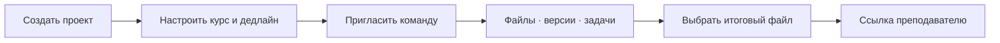

# Описание проекта SkyShelf

## Идея

SkyShelf — облачное хранилище, спроектированное вокруг жизненного цикла учебного проекта. Оно не только сохраняет файлы, но и связывает их с командой, ролями, версиями, задачами, дедлайном и итоговой сдачей.

Название объединяет `Sky` — облако и доступность из любой точки, и `Shelf` — организованную полку, на которой у каждого материала есть своё место.

## Проблема

Студенческая команда обычно распределяет работу между мессенджером, обычным облаком, заметками и локальными папками. Из-за этого:

- теряется актуальная версия;
- появляются файлы `final`, `final2`, `final_real`;
- непонятно, кто отвечает за следующий шаг;
- участникам выдают слишком широкие права;
- итоговый комплект собирают вручную перед дедлайном;
- преподавателю отправляют ссылку без понятного контекста и контроля.

Обычный cloud drive хорошо хранит файлы, но не ведёт учебный проект от идеи до сдачи.

## Цель

Создать понятное и защищённое цифровое пространство, где учебная команда может:

1. собрать материалы;
2. разделить доступ;
3. вести версии и чек‑лист;
4. выбрать единственный итоговый файл;
5. безопасно передать результат преподавателю;
6. восстановить работу после ошибки.

## Целевая аудитория

- студенты, выполняющие командные проекты, курсовые и практики;
- тимлиды учебных команд;
- преподаватели и кураторы, получающие итоговые материалы;
- небольшие проектные группы образовательных организаций.

## Бизнес-сценарии

### Личная подготовка

Студент хранит исходники и отчёты, группирует их по папкам, отмечает важные материалы, добавляет новые версии и возвращается к прежней редакции.

### Командная работа

Владелец создаёт проект, указывает предмет и дедлайн, добавляет участников и читателей. Команда загружает файлы и закрывает пункты чек‑листа.

### Контролируемая сдача

Владелец отмечает итоговый файл. SkyShelf формирует отдельную карточку для преподавателя и ZIP-пакет; рабочие черновики не раскрываются.

### Безопасный внешний доступ

На конкретный файл создаётся временная ссылка с паролем и лимитом скачиваний. Её можно отозвать в любой момент.

### Восстановление

Ошибочно изменённый документ не заменяет историю: старая версия восстанавливается как новая. Удалённый файл сначала попадает в корзину.

## Путь пользователя

## Конкурентные преимущества

| Возможность | Обычное облако | SkyShelf |
| --- | --- | --- |
| Хранение и папки | Да | Да |
| История версий | Часто есть | Есть с заметкой и автором |
| Проектные роли | Общий доступ | OWNER/MEMBER/READER |
| Курс, преподаватель, дедлайн | Нет как основной сценарий | Встроено в карточку проекта |
| Чек‑лист сдачи | Нужен отдельный сервис | Встроен |
| Единый итоговый файл | Вручную | Отдельный статус final |
| Карточка преподавателю | Обычная папка/ссылка | Специальный публичный экран |
| ZIP сдачи | Ручная сборка | Автоматический экспорт |
| Защищённые ссылки | Зависит от тарифа | Expiry + пароль + лимит + отзыв |
| Кастомизация проекта | Ограниченная | Цвет, обложка, описание и контекст курса |
| Объяснимая криптография | Скрыта от пользователя | Отдельный security center и документация |

SkyShelf не пытается победить крупные облака объёмом инфраструктуры. Отличие — цельный студенческий процесс и прозрачная модель защиты.

## Монетизация

Учебная версия не принимает платежи, но продуктовая модель может быть freemium:

- START: 15 ГБ, до пяти участников, базовые ссылки;
- PERSONAL: 100 ГБ, расширенная история и персональная работа;
- TEAM: 500 ГБ, до 25 участников, административные функции;
- Education: лицензия кафедры/вуза, централизованные команды и срок хранения работ.

До реальной монетизации нужны исследование спроса, юридическая модель, расчёт инфраструктуры, платёжный провайдер и политика персональных данных. Текущие планы — демонстрация бизнес-логики, не коммерческая оферта.

## Стек

- HTML, CSS и JavaScript — frontend без сложного build-процесса;
- Java 17 + Spring Boot — REST backend;
- Spring Security — сессии, CSRF, Argon2id и роли;
- Spring Data JPA — метаданные;
- H2 — простой локальный показ;
- PostgreSQL + MinIO — целевой Docker/cloud режим;
- Docker Compose + Nginx — инфраструктурная схема;
- AES‑256‑GCM, SHA‑256 и TOTP — защита данных.

Стек намеренно упрощён для университетского проекта: его можно запустить одним `start.bat`, объяснить преподавателю и постепенно развивать.

## Архитектурный подход

Модульный монолит выбран вместо микросервисов, потому что команда небольшая, предметная область ещё развивается, а сложность deployment должна оставаться управляемой. Границы сервисов сохраняют возможность дальнейшего выделения модулей без преждевременного усложнения.

## Результат Final 1.0

Получен работающий end-to-end продукт с реальным backend, постоянным хранением, ролями, шифрованием, версиями, student workspace и сценарием сдачи. Проект можно показать локально без внешней инфраструктуры, а PostgreSQL/MinIO-конфигурация подготовлена для следующего стенда.

Главный итог: SkyShelf демонстрирует не макет облака, а завершённый пользовательский путь «создать → совместно выполнить → защитить → сдать → восстановить при ошибке».
